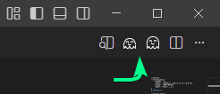
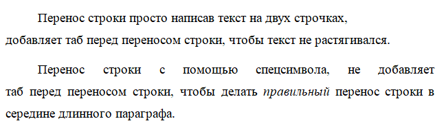

# md2gost

Расширение, позволяющее преобразовывать Markdown-файлы в документы **DOCX** и **PDF**, стараясь соблюдать требования ГОСТа для написания отчётов и курсовых работ.

Расширение работает с файлами формата `.g.md` и добавляет удобные кнопки для быстрого экспорта прямо из редактора.

* [Возможности](#возможности)
* [Требования](#требования)
* [Как использовать](#как-использовать)
* Поддерживаемый синтаксис Markdown:
	* [Текст](#текст)
	* [Заголовки](#заголовки)
	* [Списки](#списки)
	* [Картинки](#картинки)
	* [Листинг](#листинг)
	* [Таблицы](#таблицы)
	* [Коментарии](#коментарии)
	* [Разрыв страницы](#разрыв-страницы)
* Дополнительный синтаксис:
	* [Оглавление](#оглавление)
	* [Разрыв секции](#разрыв-секции)
	* [Вставка другого docx](#вставка-другого-docx)
	* [Автозамены](#автозамены)
* Переключаемые функции:
	* [Подсветка синтаксиса кода](#подсветка-синтаксиса-кода)
	* [Подпись названия и автора](#подпись-названия-и-автора)

## Возможности

* Экспорт Markdown → **DOCX**
* Экспорт Markdown → **PDF**
* Вставка содержимого других DOCX-файлов с заменой текста (например, титульник с заменой темы)
* Автоматическая замена "ИИ" тире на обычные
* Подсветка синтаксиса кода (опционально, т.к. не по ГОСТу)

## Требования

* Установленный **Microsoft Word**. (Без него работает лишь частично)

## Как использовать

1. Создайте и откройте файл с расширением `.g.md`.
2. В панели редактора появятся кнопки экспорта в DOCX и PDF

	


### Советы
* В VSCode можно вставлять картинки в md прямо из буфера обмена
	* Также можно указать, куда будет сохраняться картинка, добавив в настройки (`Ctrl+Shift+P >Open User Settings (JSON)`) следующие строки:

		```json
		"markdown.copyFiles.destination": {
			"/*": "${documentDirName}/imgs/${fileName}"
		},
		```

## Поддерживаемый синтаксис

### Текст
Пустая строка разделяет параграфы. В отличие от обычного Markdown перенос строки сохраняется в параграфе.

```md
Выделение *курсивом*
Выделение **жирным**
Выделение ***курсивом и жирным***
Неразрывный пробел: 5&nbsp;кг

Ссылка: [подпись](https://example.com)
```

Некоторые символы автоматически заменяются на другие, см. [автозамены](#автозамены).

Для вставки пустых строк можно воспользоваться символами переноса строки `<br>`.

Есть разница между переносом строки просто и переносом строки с помощью `<br>`:
```md
Перенос строки просто написав текст на двух строчках,
добавляет таб перед переносом строки, чтобы текст не растягивался

Перенос строки с помощью спецсимвола, <br>не добавляет таб перед переносом строки, чтобы делать *правильный* перенос строки
```


### Заголовки

```
# Заголовок первого уровня
## Заголовок второго уровня
### и т. д.
```

### Списки
При экспорте автоматически добавляются запятые/точка с запятой у элементов и точка у последнего элемента
```
Не нумерованный список:
* первое
* второе
- можно чертой

Нумерованный список:
1. первое
1. второе
2) можно скобкой

Вложенный список:
1. первое
	* подпункт 1
	* подпункт 2
2. второе
```

### Картинки
Картинкам можно задать размер, указав его в фигурных скобках.
В тексте подписи можно вставить перенос строки с помощью `<br>` (т.к. поддерживается только однострочное объявление картинки).

Путь к картинке вычисляется относителено `.g.md` файла

После квадратной скобки пробела быть не должно (тут он стоит из-за некоторых проблем с отображением этого файла)
```
![подпись] (путь/к/файлу.png)
![подпись] (путь/к/файлу.png){ширина x высота}

![Рисунок 1.1 - Пример] (image.png)
![Рисунок 1.2 - С указанием ширины] (image.png){340}
![Рисунок 1.3 - С указанием высоты] (image.png){x265}
![Рисунок 1.4 - С указанием размера] (image.png){340x265}
![Рисунок 1.5 - Важные зарисовки, с очень длинным названием, \nкоторое не умещается в одну строку] (image.png){340}
```


### Листинг
В отличие от обычного Markdown после кода языка в первой строке пишется заголовок листинга (при разрыве листинга на несколько страниц заголовок продублируется автоматически)

Путь к документу вычисляется относителено `.g.md` файла
````
```html Листинг 1.1 - Шаблон html страницы
<!DOCTYPE html>
<html lang="en">
<head>
    <meta charset="UTF-8">
    <meta name="viewport" content="width=device-width, initial-scale=1.0">
    <title>Document</title>
</head>
<body>
</body>
</html>
```
````

### Таблицы
Параграф перед таблицей считается её подписью и при экспорте соответствующе форматируется.

Для вставки переноса строки внутри ячейки напишите `<br>`.

```
Таблица 1 - Результат анализа

Заголовок 1 | Заголовок 2 | Заголовок 3
------------|-------------|------------
текст       | текст       | текст
текст       | текст       | текст
```

### Коментарии
Текст, который исчезнет при экспорте. Поддерживаются только однострочные комментарии.
```
<!-- Коментарий -->
<!-- в две строки -->
```

### Разрыв страницы
```
---
```


### Оглавление
Достаточно написать заголовок "Оглавление"
```
# Оглавление
```


### Разрыв секции

Создаёт разрыв секции в документе:

```
!!section
Секция без нумерации страниц

!!section from 3
Секция с нумерацией страниц начиная с 3
```

### Вставка другого DOCX

Вставляет содержимое DOCX-файла с возможностью передачи параметров.

После вставки файла необходимо добавить разрыв страницы или секции.

В импортируемом DOCX-файле полями считается любой текст в двойных фигурных скобках, пример: `{{поле}}`


> Важно!

```md
!!(путь/к/файлу.docx){"поле": "значение"}
!!section

!!(title.docx){}
!!section

!!(title.docx){
	"taskN": "1",
	"topic": "Сбалансированные деревья поиска",
	"group": "КЛМН-00-00",
	"name": "Иванов П.С.",
}
!!section from 2
```

### Автозамены

Некоторые символы автоматически заменяются на другие

- `—` на `-` ("ИИ" тире на обычные)
- ` - ` на ` – ` (пробел-тире-пробел на вордовое тире)
- `<br>` на перенос строки
- `"текст"` на `«текст»` (красивые кавычки)
- `&nbsp;` на неразрывный пробел
- `&Tab;` на отступ (таб)

### Подсветка синтаксиса кода
По ГОСТу листинги просто чёрно-белые, так что этот пункт не для курсовой

Чтобы включить подсветку кода, добавьте строчку `!!rule highlight code` в любом месте (один раз на весь файл).

Поддерживаются следующие языки:
* html, xml, css, js, ts, jsx, tsx, json, bash, powershell, python, java, c, cpp, csharp, go, rust, php, ruby, swift, kotlin, sql, yaml, markdown, docker, nginx

````html
!!rule highlight code

```html Листинг 1.1 - Красивый листинг
<!DOCTYPE html>
<html lang="en">
<head>
    <meta charset="UTF-8">
    <meta name="viewport" content="width=device-width, initial-scale=1.0">
    <title>Document</title>
</head>
<body>
</body>
</html>
```
````

### Подпись названия и автора
Отображаются в свойствах файла и в заголовке окна при открытии PDF.

```
!!rule title Мой отчёт
!!rule author Иванов П.С.
```

### Что-то ещё
* Установить время редактирования в минутах
	- `!!rule etime <int>`
	- Пример: `!!rule etime 123`
	- По умолчанию: случайное число от 30 до 120
* Установить время создания
	- `!!rule ctime <ISO 8601>`
	- Пример: `!!rule ctime 2026-02-18`
	- По умолчанию: время создания `.g.md` файла
* Установить время изменения
	- `!!rule mtime <ISO 8601>`
	- Пример: `!!rule mtime 2026-02-18T12:30:00`
	- По умолчанию: время рендера
* `!!rule rainbow`
