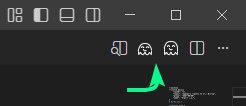
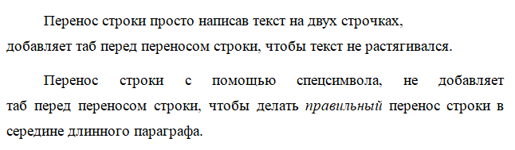
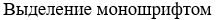
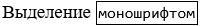
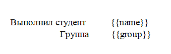

# md2gost

Расширение, позволяющее преобразовывать Markdown-файлы в документы **DOCX** и **PDF**, стараясь соблюдать требования ГОСТа для написания отчётов и курсовых работ.

Расширение работает с файлами формата `.g.md` и добавляет удобные кнопки для быстрого экспорта прямо из редактора.

Другие интересные/полезные проекты автора: [тут ](https://t.me/+gDaSs1PD7LhkODRi) и [тут ](https://mixelte.github.io/)

**Оглавление:**

* [Возможности](#возможности)
* [Требования](#требования)
* [Как использовать](#как-использовать)
* Поддерживаемый синтаксис Markdown:
	* [Текст](#текст)
	* [Заголовки](#заголовки)
	* [Списки](#списки)
	* [Картинки](#картинки)
	* [Листинг](#листинг)
	* [Таблицы](#таблицы)
	* [Коментарии](#коментарии)
	* [Разрыв страницы](#разрыв-страницы)
* Дополнительный синтаксис:
	* [Правила (!!rule)](#правила)
	* [Оглавление](#оглавление)
	* [Разрыв секции](#разрыв-секции)
	* [Автонумерация](#автонумерация)
	* [Вставка другого docx](#вставка-другого-docx)
	* [Автозамены](#автозамены)
* Переключаемые функции:
	* [Подсветка синтаксиса кода](#подсветка-синтаксиса-кода)
	* [Подпись названия и автора](#подпись-названия-и-автора)
	* [Что-то ещё](#что-то-ещё)

## Возможности

<!-- * Автонумерация рисунков, таблиц, листингов, разделов, источников с возможностью ссылаться на них -->
* Экспорт Markdown → **DOCX**
* Экспорт Markdown → **PDF**
* [Автонумерация](#автонумерация) рисунков, таблиц, листингов, разделов с возможностью ссылаться на них
* [Вставка содержимого других](#вставка-другого-docx) DOCX-файлов с заменой текста (например, титульник с заменой темы)
* Автоматическое добавление "Продолжение листинга #" при разрыве листинга на несколько страниц
* Автоматическая замена "ИИ" тире на обычные
* [Подсветка синтаксиса кода](#подсветка-синтаксиса-кода) (опционально, т.к. не по ГОСТу)

## Требования

* Основной функционал
	* Никаких
* Полный функционал
	* **Windows**
	* Установленный **Microsoft Word**

Без полного функционала отсутствует:
* Экспорт в PDF
* Автоматическое добавление "Продолжение листинга #"
* Вставка содержимого других DOCX-файлов

## Как использовать

1. Создайте и откройте файл с расширением `.g.md`.
2. В панели редактора появятся кнопки экспорта в DOCX и PDF

	


### Советы
* В VSCode можно вставлять картинки в md прямо из буфера обмена
	* Также можно указать, куда будет сохраняться картинка, добавив в настройки (`Ctrl+Shift+P >Open User Settings (JSON)`) следующие строки:

		```json
		"markdown.copyFiles.destination": {
			"*": "${documentDirName}/imgs/${fileName}"
		},
		```

## Поддерживаемый синтаксис

### Текст
Пустая строка разделяет параграфы. В отличие от обычного Markdown перенос строки сохраняется в параграфе.

```md
Выделение *курсивом*
Выделение **жирным**
Выделение ***курсивом и жирным***
Выделение `моношрифтом` (см. ниже)
Неразрывный пробел: 5&nbsp;кг

Ссылка: [подпись](https://example.com)
```

Некоторые символы автоматически заменяются на другие, см. [автозамены](#автозамены).

Для вставки пустых строк можно воспользоваться символами переноса строки `<br>`.

Есть разница между переносом строки просто и переносом строки с помощью `<br>`:
```md
Перенос строки просто написав текст на двух строчках,
добавляет таб перед переносом строки, чтобы текст не растягивался

Перенос строки с помощью спецсимвола, <br>не добавляет таб перед переносом строки, чтобы делать *правильный* перенос строки
```


Выделение с помощью обратных кавычек ``` `монотекст` ``` по умолчанию отображается как курсив. С помощью [правила](#правила) `backtick_mono` можно именить отображение:
* `!!rule backtick_mono off` - курсив (по умолчанию)

	

* `!!rule backtick_mono on` - моношрифт

	

* `!!rule backtick_mono outline` - моношрифт в рамочке

	


### Заголовки

```
# Заголовок первого уровня
## Заголовок второго уровня
### и т. д.
```

### Списки
При экспорте автоматически добавляются запятые/точка с запятой у элементов и точка у последнего элемента
```
Не нумерованный список:
* первое
* второе
- можно чертой

Нумерованный список:
1. первое
1. второе
2) можно скобкой

Вложенный список:
1. первое
	* подпункт 1
	* подпункт 2
2. второе
```

### Картинки
Картинкам можно задать размер, указав его в фигурных скобках.
В тексте подписи можно вставить перенос строки с помощью `<br>` (т.к. поддерживается только однострочное объявление картинки).

Путь к картинке вычисляется относителено `.g.md` файла

После квадратной скобки пробела быть не должно (тут он стоит из-за некоторых проблем с отображением этого файла)
```
![подпись] (путь/к/файлу.png)
![подпись] (путь/к/файлу.png){ширина x высота}

![Рисунок 1.1 - Пример] (image.png)
![Рисунок 1.2 - С указанием ширины] (image.png){340}
![Рисунок 1.3 - С указанием высоты] (image.png){x265}
![Рисунок 1.4 - С указанием размера] (image.png){340x265}
![Рисунок 1.5 - Важные зарисовки, с очень длинным названием, \nкоторое не умещается в одну строку] (image.png){340}
```


### Листинг
В отличие от обычного Markdown после кода языка в первой строке пишется заголовок листинга (при разрыве листинга на несколько страниц заголовок продублируется автоматически)

Путь к документу вычисляется относителено `.g.md` файла
````
```html Листинг 1.1 - Шаблон html страницы
<!DOCTYPE html>
<html lang="en">
<head>
    <meta charset="UTF-8">
    <meta name="viewport" content="width=device-width, initial-scale=1.0">
    <title>Document</title>
</head>
<body>
</body>
</html>
```
````

### Таблицы
Параграф перед таблицей считается её подписью и при экспорте соответствующе форматируется.

Для вставки переноса строки внутри ячейки напишите `<br>`.

```
Таблица 1 - Результат анализа

Заголовок 1 | Заголовок 2 | Заголовок 3
------------|-------------|------------
текст       | текст       | текст
текст       | текст       | текст
```

Поддерживается выравнивание текста с помощью двоеточия `:`. Вертикальные черты по краям таблицы опциональны.

```
Таблица 1 - Результат анализа

| Слева | По центру | Справа |
|:------|:---------:|-------:|
| текст |   текст   |  текст |
| текст |   текст   |  текст |
```

### Коментарии
Текст, который исчезнет при экспорте. Поддерживаются только однострочные комментарии.
```
<!-- Коментарий -->
<!-- в две строки -->
```

### Разрыв страницы
```
---
```


### Правила
Правила - специальные команды для изменения работы системы. Их можно писать в любом месте документа - они влияют на весь документ вне зависимости от расположения. Если одно и тоже правило указано несколько раз, используется последнее значение.

```
!!rule имя правила
```

### Оглавление
Достаточно написать заголовок "Оглавление"
```
# Оглавление
```


### Разрыв секции

Создаёт разрыв секции в документе:

```
!!section
Секция без нумерации страниц

!!section from 3
Секция с нумерацией страниц начиная с 3
```

### Автонумерация
Система автонумерации автоматически нумерует элементы документа (разделы, рисунки, таблицы, листинги) и позволяет ссылаться на них из текста. *(Автонумерация списка источников пока в разработке)*

Номера элементов и ссылки задаются выражениями в квадратных скобках: `[...]`.

Поведение автонумерации можно [настроить (см. тут)](#настройки-автонумерации).

#### Базовый функционал:

В тексте `[#]` указывает на следующий элемент нумерации - рисунок, таблица, листинг - первое, что из этого встретилось.

В подписи элемента `[#]` заменяется на номер и подпись (например: `Рисунок 1 - `).

В заголовках первого уровня цифра, поставленная вручную, распознаётся и последующие `[#]` продолжают с неё.

**Ссылка на следующий элемент:**

````md
# 1 Примеры
## [#] Пример с рисунком
На рисунке [#] показан кот.

![[#] Кот] (cat.png)
![[#] Кот] (cat.png)

## [#] Пример с листингом
В листинге [#] показан код.

```html [#] Одинокий div
<div></div>
```

## [#] Пример с таблицей
В таблице [#] показаны результаты анализа.

[#] Результат анализа

Заголовок 1 | Заголовок 2
------------|------------
текст       | текст
````

**Результат:**
````md
# 1 Примеры
## 1.1 Пример с рисунком
На рисунке 1 показан кот.

![Рисунок 1 - Кот] (cat.png)
![Рисунок 2 - Кот] (cat.png)

## 1.2 Пример с листингом
В листинге 1 показан код.

```html Листинг 1 - Одинокий div
<div></div>
```

## 1.3 Пример с таблицей
В таблице 1 показаны результаты анализа.

Таблица 1 - Результат анализа

Заголовок 1 | Заголовок 2
------------|------------
текст       | текст
````

*У картинки перед круглой скобкой пробела быть не должно (тут он стоит из-за некоторых проблем с отображением этого файла)*

**Нумерация по разделам:**
```md
!!rule numbering sections on
# 1 Первый раздел
На рисунке [#] показан кот.

![[#] Кот] (cat.png)
![[#] Кот] (cat.png)

# [#] Второй раздел
На рисунке [#] показан кот.

![[#] Кот] (cat.png)
![[#] Кот] (cat.png)
```
**Результат:**
```md
# 1 Первый раздел
На рисунке 1.1 показан кот.

![Рисунок 1.1 - Кот] (cat.png)
![Рисунок 1.2 - Кот] (cat.png)

# 2 Второй раздел
На рисунке 2.1 показан кот.

![Рисунок 2.1 - Кот] (cat.png)
![Рисунок 2.2 - Кот] (cat.png)
```


#### Относительные ссылки

К номеру можно применять смещение: `[# ± N]`.

```
[#-1]   предыдущий элемент
[#+2]   через два вперёд
[#-3]   на три назад
```
**Примеры:**

```
![[#] Мяч] (ball.png)
На рисунке [#-1] был изображён кот

Ниже, на рисунках [#]-[#+2] изображены коты
![[#] Кот] (cat1.png)
![[#] Котик] (cat2.png)
![[#] Котяра] (cat3.png)
Выше, на рисунках [#-3]-[#-1] были изображены коты
```

**Результат:**
```md
![Рисунок 1 - Мяч] (ball.png)
На рисунке 1 был изображён кот

Ниже, на рисунках 2-4 изображены коты
![Рисунок 2 - Кот] (cat1.png)
![Рисунок 3 - Котик] (cat2.png)
![Рисунок 4 - Котяра] (cat3.png)
Выше, на рисунках 2-4 были изображены коты
```
*У картинок перед круглой скобкой пробела быть не должно (тут он стоит из-за некоторых проблем с отображением этого файла)*

#### Именованные ссылки
Элементу можно присвоить идентификатор, который позволяет ссылаться на него из других мест документа: `[name]`. Идентификатор может состоять из латинских и кириллических букв, цифр и нижнего подчёркивания (без пробелов!). Идентификатор чувствителен к регистру.

```md
В разделе [cats] вопрос будет рассмотрен подробнее

## [cats] О котах
Ниже, на рисунках [cat]-[Котяра] изображены коты
![[cat] Кот] (cat1.png)
![[img2] Котик] (cat2.png)
![[Котяра] Котяра] (cat3.png)
```

К именованной ссылке также можно применять смещение: `[name ± N]`.
```md
Ниже, на рисунках [cat]-[cat+2] изображены коты
![[cat] Кот] (cat1.png)
![[#] Котик] (cat2.png)
![[#] Котяра] (cat3.png)
```
*У картинок перед круглой скобкой пробела быть не должно (тут он стоит из-за некоторых проблем с отображением этого файла)*


#### Количество элементов
Специальные выражения выводят общее количество элементов.

```
Документ содержит [!pages] страниц,
[!imgs] рисунков,
[!tables] таблиц,
[!codes] листингов.
```

**Примечание:** `[!pages]` может отображаться некоректно до рендера в pdf (как пустота или неверное значение). В таком случае выделите это место в Word и нажмите ПКМ->"Обновить поле" (при рендере в pdf не требуется).

#### Настройки автонумерации
* Включить ленивую автонумерации: `!!rule numbering lazy`
	* Когда включено, более не нужно писать `[#]` в названиях картинок, таблиц и т.д. - добавляется автоматически
* Включить нумерацию по разделам: `!!rule numbering sections`
	* `Рисунок 1 - Кот` -> `Рисунок 1.1 - Кот`
* Отключить автоматическое добавление названия элемента: `!!rule numbering autoprefix off`
	* `![[#] Кот] (cat.png)`:
		* `Рисунок 1 - Кот` -> `1 Кот`
	* `![Рисуночек [#]: Кот] (cat.png)`:
		* `Рисуночек Рисунок 1 - : Кот` -> `Рисуночек 1: Кот`

Пример с включённой ленивой автонумерацией (именованные элементы продолжают работать как раньше):
````md
!!rule numbering lazy
Ниже, на рисунках [#] и [cat] изображены коты
![Кот] (cat1.png)
![[cat] Котик] (cat2.png)

В таблице [#] показаны результаты анализа.

Результат анализа

Заголовок 1 | Заголовок 2
------------|------------
текст       | текст

Код представлен в листинге [#].

```html Шаблон html страницы
<html></html>
```
````


### Вставка другого DOCX

Вставляет содержимое DOCX-файла с возможностью передачи параметров.

После вставки файла необходимо добавить разрыв страницы или секции.

В импортируемом DOCX-файле полями считается любой текст в двойных фигурных скобках, пример: `{{поле}}`



> Вставка другого DOCX возможна только при экспорте в PDF

```md
!!(путь/к/файлу.docx){"поле": "значение"}
!!section

!!(title.docx){}
!!section

!!(title.docx){
	"taskN": "1",
	"topic": "Сбалансированные деревья поиска",
	"group": "КЛМН-00-00",
	"name": "Иванов П.С.",
}
!!section from 2
```

Документ можно вставить не только в начало файла, для этого обрамите его двумя `!!section` или переносами страниц (разница в том, что `!!section` начинает новую нумерацию страниц).

```md
Что-то до

---
!!(важная вставка.docx){}
---

Что-то после
```

### Автозамены

Некоторые символы автоматически заменяются на другие

- `—` на `-` ("ИИ" тире на обычные)
- ` - ` на ` – ` (пробел-тире-пробел на вордовое тире)
- `<br>` на перенос строки
- `"текст"` на `«текст»` (красивые кавычки)
- `&nbsp;` на неразрывный пробел
- `&Tab;` на отступ (таб)
- `&Star;` на `*`
- `[!pages]` на кол-во страниц
- `[!imgs]` на кол-во картинок
- `[!tables]` на кол-во таблиц
- `[!codes]` на кол-во листингов
- `[!sources]` на кол-во источников

### Подсветка синтаксиса кода
По ГОСТу листинги просто чёрно-белые, так что этот пункт не для курсовой

Чтобы включить подсветку кода, добавьте строчку `!!rule highlight code` в любом месте (один раз на весь файл).

Поддерживаются следующие языки:
* html, xml, css, js, ts, jsx, tsx, json, bash, powershell, python, java, c, cpp, csharp, go, rust, php, ruby, swift, kotlin, sql, yaml, markdown, docker, nginx

````html
!!rule highlight code

```html Листинг 1.1 - Красивый листинг
<!DOCTYPE html>
<html lang="en">
<head>
    <meta charset="UTF-8">
    <meta name="viewport" content="width=device-width, initial-scale=1.0">
    <title>Document</title>
</head>
<body>
</body>
</html>
```
````

### Подпись названия и автора
Отображаются в свойствах файла и в заголовке окна при открытии PDF.

```
!!rule title Мой отчёт
!!rule author Иванов П.С.
```

### Что-то ещё
* Установить время редактирования в минутах
	- `!!rule etime <int>`
	- Пример: `!!rule etime 123`
	- По умолчанию: случайное число от 30 до 120
* Установить время создания
	- `!!rule ctime <ISO 8601>`
	- Пример: `!!rule ctime 2026-02-18`
	- По умолчанию: время создания `.g.md` файла
* Установить время изменения
	- `!!rule mtime <ISO 8601>`
	- Пример: `!!rule mtime 2026-02-18T12:30:00`
	- По умолчанию: время рендера
* `!!rule rainbow`
