# md2gost

Расширение для преобразования Markdown-файлов в **DOCX** и **PDF** с автоматическим соблюдением требований ГОСТ (курсовые, отчёты, дипломы). *Соответствие ГОСТ максимально приближено, но не гарантируется на 100%.*

Другие интересные/полезные проекты автора: [тут ](https://t.me/+gDaSs1PD7LhkODRi) и [тут ](https://mixelte.github.io/)

> 🎓 **Пишете курсовую?** Ознакомьтесь с [готовым шаблоном и правилами оформления](#написание-курсовой-работы).

Если вам не хватает какой-то функции или вы знаете, как сделать инструмент лучше – пишите в [Issues](https://github.com/MixelTe/md2gost/issues). Рациональные предложения попадают в план, безумные – ждут вдохновения.

> 💡 **Также доступно в виде [пакета npm](https://www.npmjs.com/package/md2gost)** с поддержкой CLI.

## 👻 Быстрый старт

1. Создайте файл с расширением `.g.md`
2. Откройте его в VS Code
3. Напишите документ (или вставьте пример ниже)
4. Нажмите кнопку экспорта:

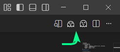

## ✨ Возможности

- Экспорт Markdown → **DOCX / PDF**
- [Автонумерация](#автонумерация) (рисунки, таблицы, листинги, источники)
- Генерация [оглавления](#написание-курсовой-работы)
- Поддержка ГОСТ-структуры курсовой работы
- [Вставка других DOCX/PDF](#вставка-внешнего-документа) (например, титульник)
- Автоматическое добавление "Продолжение таблицы/листинга #" при разрыве таблиц/листингов на несколько страниц
- [Подсветка кода](#подсветка-синтаксиса-кода) (опционально)
- Автоматическая замена "ИИ" тире на обычные
- Удобный [графический редактор](#редактор-таблиц) Markdown таблиц
- Форматирование Markdown файлов

## ⚙️ Требования
* Основной функционал
	* Никаких
* Полный функционал
	* **Windows**
	* Установленный **Microsoft Word**

Без Word будут недоступны:
* Экспорт в PDF
* Автоматическое добавление "Продолжение таблицы/листинга #"
* Вставка содержимого других DOCX-файлов


## 📖 Документация
* [Как использовать](#как-использовать)
* [Шаблон курсовой работы](#написание-курсовой-работы)
* [Редактор таблиц](#редактор-таблиц)
* [Настройка стилей](#настройка-стилей)
* [Настройки расширения](#️-настройки-расширения)
* Поддерживаемый синтаксис Markdown:
	* [Текст](#текст)
	* [Заголовки](#заголовки)
	* [Списки](#списки)
	* [Картинки](#картинки)
	* [Листинг](#листинг)
	* [Таблицы](#таблицы)
	* [Формулы](#формулы)
	* [Комментарии](#комментарии)
	* [Блоки Admonition](#блоки-admonition)
	* [Разрыв страницы](#разрыв-страницы)
* Дополнительный синтаксис:
	* [Правила (!!rule)](#правила)
	* [Оглавление](#оглавление)
	* [Разрыв раздела](#разрыв-раздела)
	* [Колонтитулы](#колонтитулы)
	* [Автонумерация](#автонумерация)
	* [Вставка docx/pdf (вставка титульника)](#вставка-внешнего-документа)
	* [Автозамены](#автозамены)
* Переключаемые функции:
	* [Подсветка синтаксиса кода](#подсветка-синтаксиса-кода)
	* [Подпись названия и автора](#подпись-названия-и-автора)
	* [Что-то ещё](#что-то-ещё)

## Как использовать
#### 1. Создание файла
Создайте файл с расширением `.g.md` (например: `report.g.md`) и откройте его в VS Code.

#### 2. Напишите документ
Поддерживается весь синтаксис Markdown + присутствует дополнительный синтаксис.

```md
!!(title.docx){}
!!section from 2

# Начало пути

Это пример документа.

На рисунке [#] показан кот.

![[#] Кот](cat.png)
```

#### 3. Экспортируйте документ

* Маленький призрак -> DOCX
* Большой призрак -> PDF

#### 📄 Результат

```
# Начало пути

На рисунке 1 показан кот.

Рисунок 1 – Кот
```

#### 📌 Что делает этот пример

* `!!(title.docx){}` – вставляет титульный лист *(только при экспорте в PDF)*. [(подробнее)](#вставка-внешнего-документа)
* `!!section from 2` – начинает нумерацию страниц с 2 (после титульника). [(подробнее)](#разрыв-раздела)
* `[#]` – автоматически подставляет номер рисунка. [(подробнее)](#автонумерация)
* `![[#] Кот](cat.png)` – создаёт рисунок с подписью по ГОСТ


### Советы
* Не нумеруйте вручную – используйте `[#]`
* Включите [ленивую автонумерацию](#настройки-автонумерации) – чтобы не писать `[#]`
* В VSCode можно вставлять картинки в md прямо из буфера обмена
	* Также можно указать, куда будет сохраняться картинка, добавив в настройки (`Ctrl+Shift+P >Open User Settings (JSON)`) следующие строки:

		```json
		"markdown.copyFiles.destination": {
			"*": "${documentDirName}/imgs/${fileName}"
		},
		```


## Написание курсовой работы

При рендере `md2gost` автоматически формирует специфические разделы курсовой работы согласно ГОСТ.

В связи с различными требованиями к оформлению, вам может понадобится изменить [настройки стилей](#настройка-стилей). Строка `!!rule numbering lazy` включает [ленивую автонумерацию](#настройки-автонумерации) для всех элементов.

### Шаблон файла
Используйте этот скелет как основу вашего `.g.md` файла. Заголовки, написанные капсом, являются **ключевыми словами**, активирующими автоматику.

````md
!!rule numbering lazy
!!(title.docx){}
!!section from 3

# РЕФЕРАТ
ключевые, слова, 5-15 штук

Текст реферата на одной странице.

# ОГЛАВЛЕНИЕ

# ТЕРМИНЫ И ОПРЕДЕЛЕНИЯ
* Термин: Определение после двоеточия
* DOM: Объектная модель документа...
* Git: Система контроля версий...

# ПЕРЕЧЕНЬ СОКРАЩЕНИЙ И ОБОЗНАЧЕНИЙ
* HTML - HyperText Markup Language
* JS - JavaScript

# ВВЕДЕНИЕ
Текст...

# 1 Основная часть
## 1.1 Подраздел
Текст с ссылкой на источник [[mdn]].
Текст с ссылкой на картинку [#] (или [cat]).
![[cat] Кот](cat1.png)
Текст с ссылкой на картинку [cat].

## 1.2 Подраздел
Текст с ссылкой на приложение [код] и на листинг [кодhtml] в нём.

# ЗАКЛЮЧЕНИЕ
...

# СПИСОК ИСПОЛЬЗОВАННЫХ ИСТОЧНИКОВ
[s1] Источник 1
[mdn] Документация MDN Web Docs [Электронный ресурс]. – URL: https://developer.mozilla.org/

# ПРИЛОЖЕНИЯ
## [код] Код приложения
```html [кодhtml] Шаблон html страницы
<!DOCTYPE html>
<html lang="en">
</html>
```
## [imgs] Графический материал
![[just_cat] Кот обыкновенный](cat1.png)
![[imgs_кот] Кот необыкновенный](cat2.png)
````

### Особенности автоматизации разделов

При использовании указанных выше заголовков, `md2gost` применяет к ним специальную логику:

| Раздел                     | Что делает автоматика                                                                                                                          |
|----------------------------|------------------------------------------------------------------------------------------------------------------------------------------------|
| **РЕФЕРАТ**                | Добавляет строку со статистикой: `Отчет x с., x рис., x табл., x лист., x источн.` Ключевые слова автоматически переводятся в ВЕРХНИЙ РЕГИСТР. |
| **ОГЛАВЛЕНИЕ**             | Генерирует иерархический список всех разделов с указанием страниц.                                                                             |
| **ТЕРМИНЫ И ОПРЕДЕЛЕНИЯ**  | Вставляет фразу *«В настоящем отчете применяются следующие термины...»* и преобразует список в таблицу.                                        |
| **ПЕРЕЧЕНЬ СОКРАЩЕНИЙ...** | Вставляет фразу *«В настоящем отчете применяют следующие сокращения...»*.                                                                      |
| **ИСТОЧНИКИ**              | Автоматически нумерует и **сортирует источники** в порядке их первого упоминания в тексте.                                                     |
| **ПРИЛОЖЕНИЯ**             | Выносит каждый подраздел на новую страницу. Нумерует приложения буквами (А, Б, В...).                                                          |

**Важные нюансы:**
1. **Разрыв страниц:** После каждого из этих разделов (кроме введения и основной части), а также между приложениями, разрыв страницы добавляется автоматически.
2. **Разделы:** [Команда](#разрыв-раздела) `!!section from 3` позволяет начать нумерацию страниц с нужного числа (обычно с реферата), пропустив [титульный лист](#вставка-внешнего-документа) и задание.
3. **Ссылки и идентификаторы:** В квадратных скобках пишутся ссылки на элементы:
	* В тексте для источников указывайте [[mdn]] – программа заменит его на номер (например, [2]).
	* Для картинок, таблиц, листингов и приложений указывайте «...в листинге [indexjs]» или «...в приложении [код]» – автоматика заменит их на правильные буквенно-цифровые ссылки: «...в листинге 1» или «...в приложении А».


## Поддерживаемый синтаксис

### Текст
Пустая строка разделяет параграфы. В отличие от обычного Markdown перенос строки сохраняется в параграфе.

```md
Выделение *курсивом*
Выделение **жирным**
Выделение ***курсивом и жирным***
Выделение `моношрифтом` (см. ниже)
Неразрывный пробел: 5&nbsp;кг

Ссылка: [подпись](https://example.com)
```

Некоторые символы автоматически заменяются на другие, см. [автозамены](#автозамены).

Для вставки пустых строк можно воспользоваться символами переноса строки `<br>`.

Есть разница между переносом строки просто и переносом строки с помощью `<br>`:
```md
Перенос строки просто написав текст на двух строчках,
добавляет таб перед переносом строки, чтобы текст не растягивался

Перенос строки с помощью спецсимвола, <br>не добавляет таб перед переносом строки, чтобы делать *правильный* перенос строки
```
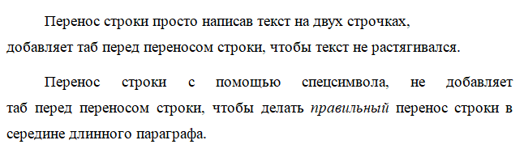

Выделение с помощью обратных кавычек ``` `монотекст` ``` по умолчанию отображается как курсив. С помощью [правила](#правила) `backtick_mono` можно изменить отображение:
* `!!rule backtick_mono italic` – курсив (по умолчанию)

	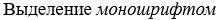

* `!!rule backtick_mono off` – обычный текст

	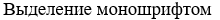

* `!!rule backtick_mono on` – моношрифт

	

* `!!rule backtick_mono outline` – моношрифт в рамочке

	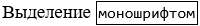


### Заголовки

```
# Заголовок первого уровня
## Заголовок второго уровня
### и т. д.
```

### Списки
При экспорте автоматически добавляются запятые/точка с запятой у элементов и точка у последнего элемента
```
Не нумерованный список:
* первое
* второе
- можно чертой

Нумерованный список:
1. первое
1. второе
2) можно скобкой

Вложенный список:
1. первое
	* подпункт 1
	* подпункт 2
2. второе
```

### Картинки
Картинкам можно задать размер, указав его в фигурных скобках.
В тексте подписи можно вставить перенос строки с помощью `<br>` (т.к. поддерживается только однострочное объявление картинки).

Путь к картинке вычисляется относителено `.g.md` файла

После квадратной скобки пробела быть не должно (тут он стоит из-за некоторых проблем с отображением этого файла)
```
![подпись] (путь/к/файлу.png)
![подпись] (путь/к/файлу.png){ширина x высота}

![Рисунок 1.1 - Пример] (image.png)
![Рисунок 1.2 - С указанием ширины] (image.png){340}
![Рисунок 1.3 - С указанием высоты] (image.png){x265}
![Рисунок 1.4 - С указанием размера] (image.png){340x265}
![Рисунок 1.5 - Важные зарисовки, с очень длинным названием, <br>которое не умещается в одну строку] (image.png){340}
```


### Листинг
В отличие от обычного Markdown после кода языка в первой строке пишется заголовок листинга (при разрыве листинга на несколько страниц заголовок продублируется автоматически).

````
```html Листинг 1.1 - Шаблон html страницы
<!DOCTYPE html>
<html lang="en">
<head>
    <meta charset="UTF-8">
    <meta name="viewport" content="width=device-width, initial-scale=1.0">
    <title>Document</title>
</head>
<body>
</body>
</html>
```
````

Если листинг содержит текст, не являющийся языком программирования, укажите любую строку.
````
```txt Листинг 1.2 - Важные заметки
Этот листинг содержит просто текст. В качестве языка указано txt, но можно указать что угодно
```
````

### Таблицы
Параграф перед таблицей считается её подписью и при экспорте соответствующе форматируется.

Для вставки переноса строки внутри ячейки напишите `<br>`.

```md
Таблица 1 - Результат анализа

Заголовок 1 | Заголовок 2 | Заголовок 3
------------|-------------|------------
текст       | текст       | текст
текст       | текст       | текст
```

Поддерживается выравнивание текста с помощью двоеточия `:`. Вертикальные черты по краям таблицы опциональны.

```md
Таблица 1 - Результат анализа

| Слева | По центру | Справа |
|:------|:---------:|-------:|
| текст |   текст   |  текст |
| текст |   текст   |  текст |
```

### Формулы

Формулы записываются в LaTeX-синтаксис. Строчные формулы заключаются в одинарные знаки доллара, а блочные — в двойные. Открывающий и закрывающий маркеры блочной формулы должны находиться на отдельных строках; формулы внутри абзаца при экспорте не считаются блочными. Чтобы вывести знак доллара как обычный символ, экранируйте его обратным слешем: `\$`.

```md
Скорость равна $v = \frac{s}{t}$.

$$
E = mc^2
$$
```

Чтобы указать номер блочной формуле напишите любой текст в круглых скобках на отдельной строке непосредственно перед формулой:

```md
(А.1)
$$
E = mc^2
$$

Как показано в формуле А.1, энергия зависит от массы.
```

### Комментарии
Этот текст исчезнет при экспорте. Поддерживаются только отдельно стоящие комментарии.
```md
<!-- Комментарий -->
<!-- Комментарий
в две строки -->

<!-- Исчезнет вся строка --> это тоже исчезнет
```

### Блоки Admonition

Admonition – это выделенный информационный блок. Синтаксис совместим с [Admonitions в Docusaurus](https://docusaurus.io/docs/markdown-features/admonitions): блок начинается с трёх двоеточий и его типа, а заканчивается строкой из трёх двоеточий.

> **Важно:** Admonition не является элементом оформления по ГОСТ. Используйте его в документах, где важнее наглядно отделить примечание, рекомендацию или предупреждение, чем строго следовать ГОСТ.

Поддерживаются типы `note`, `info`, `tip`, `warning` и `danger`. У каждого типа свой цвет; при стандартных настройках это соответственно нейтральный, синий, зелёный, оранжевый и красный блок.

````md
:::note
Обычное примечание. Внутри работает Markdown: **жирный текст**, *курсив* и [ссылки](https://example.com).
:::

:::info
В процессе измерения допускается отклонение температуры не более чем на 2 °C от заданного значения.
:::

:::tip
Для повышения точности измерений выполняйте калибровку прибора перед каждой серией экспериментов.
:::

:::warning
Перед запуском алгоритма убедитесь, что входные данные приведены к единому масштабу.
:::

:::danger
Удаление исходных данных до завершения обработки делает результаты эксперимента невосстановимыми.
:::
````

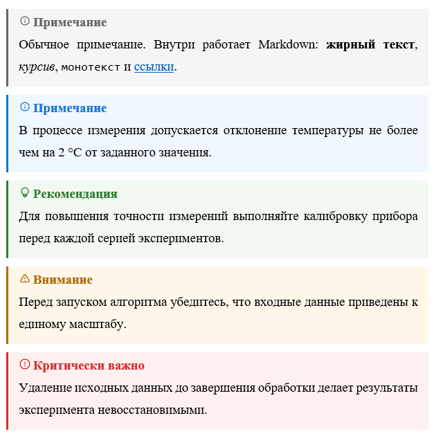

Заголовок блока можно заменить своим текстом, указав его в квадратных скобках, можно указать пустой заголовок. Некоторые форматтеры Markdown требуют пустые строки внутри блока, поэтому для них используйте такой вариант. Форматтер, идущий вместе с расширением, понимает Admonition и без пустых строк.

````md
:::tip[Рекомендация по *измерениям*]

Перед каждой серией измерений выполняйте калибровку прибора.

:::
:::note[]
Без заголовка
:::
:::note[ ]
Без заголовка, но с иконкой
:::
````

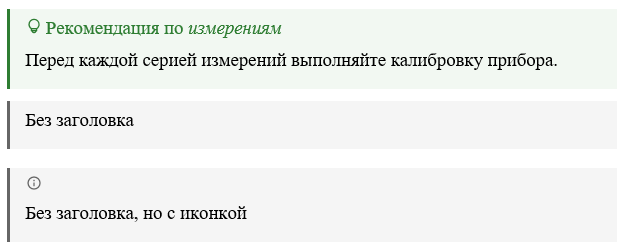

#### Настройка оформления

Оформление меняется правилами `!!rule`. Вместо `<type>` укажите один из типов блока или `all`, чтобы применить правило ко всем Admonition; правило для конкретного типа, указанное позднее, имеет приоритет.

Правило `title` используется, только когда заголовок не указан в квадратных скобках у самого блока, можно указать пустое значение чтобы убрать заголовок (укажите `&nbsp;` чтобы сохранить иконку с пустым заголовком).

| Что настраивается                                       | Правило                                                    | Пример                                         |
|---------------------------------------------------------|------------------------------------------------------------|------------------------------------------------|
| Внешний отступ до/после блока, пт                       | `!!rule admonition <type> spacing <before\|after> <int>`   | `!!rule admonition all spacing before 8`       |
| Отступ блока слева, см                                  | `!!rule admonition <type> indent <float>`                  | `!!rule admonition all indent 1.25`            |
| Внутренние отступы блока по горизонтали и вертикали, пт | `!!rule admonition <type> padding <horizontal> <vertical>` | `!!rule admonition all padding 10 6`           |
| Цвет фона                                               | `!!rule admonition <type> background <#RRGGBB>`            | `!!rule admonition warning background #FFF6E8` |
| Акцентный цвет: полоска, заголовок и иконка             | `!!rule admonition <type> color <#RRGGBB>`                 | `!!rule admonition warning color #B26A00`      |
| Ширина цветной полоски слева, пт                        | `!!rule admonition <type> bar_width <float>`               | `!!rule admonition all bar_width 2.25`         |
| Показывать иконку возле заголовка                       | `!!rule admonition <type> icon <on\|off>`                  | `!!rule admonition note icon off`              |
| Размер иконки, пт                                       | `!!rule admonition <type> icon size <int>`                 | `!!rule admonition all icon size 16`           |
| Окрашивать заголовок акцентным цветом                   | `!!rule admonition <type> title_color <on\|off>`           | `!!rule admonition all title_color off`        |
| Заголовок по умолчанию                                  | `!!rule admonition <type> title <текст>`                   | `!!rule admonition warning title **Важно**`    |

Например, следующий набор правил создаёт блоки в строгом стиле, а для критического сообщения задаёт более заметный цвет:

```
!!rule admonition all padding 6 4
!!rule admonition all icon off
!!rule admonition all title_color off
!!rule admonition all background #ffffff
!!rule admonition danger background #FFF4F4
!!rule admonition danger icon on
```

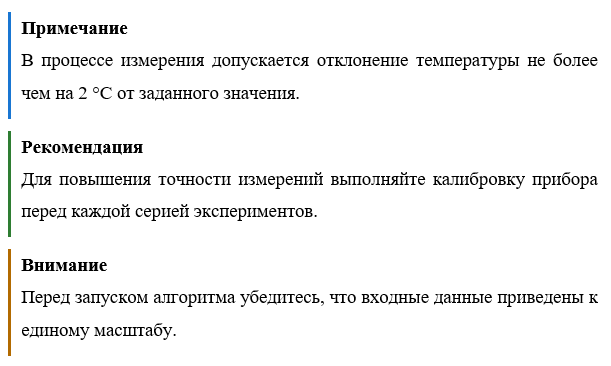

### Разрыв страницы
```
---
```

Для вставки разрыва раздела см. [Разрыв раздела](#разрыв-раздела).


### Правила
Правила – специальные команды для изменения работы системы. Их можно писать в любом месте документа – они влияют на весь документ вне зависимости от расположения. Если одно и тоже правило указано несколько раз, используется последнее значение.

```
!!rule имя правила
```

### Оглавление
Достаточно написать заголовок "Оглавление"
```
# Оглавление
```


### Разрыв раздела

Вставляет разрыв раздела и задаёт параметры форматирования для следующей страницы: ориентацию листа и логику нумерации.

**Синтаксис:**

```text
!!section [ориентация] [нумерация]
```

Параметры не зависят от порядка следования и являются необязательными. Если параметр не указан, раздел сохраняет настройки предыдущей страницы.

**Параметры:**

| Параметр | Значения | Описание |
| --- | --- | --- |
| **Ориентация** | `landscape`<br>`portrait` | Устанавливает альбомную или книжную ориентацию листа. |
| **Нумерация** | `from <N>`<br>`unpaged` | Сбрасывает счетчик страниц на число `N` либо полностью отключает нумерацию на страницах раздела. |

**Примеры использования:**

```text
!!section
Раздел с параметрами предыдущей страницы

!!section landscape
Альбомная ориентация (сквозная нумерация сохраняется)

!!section portrait
Возврат к книжной ориентации

!!section from 3
Нумерация страниц начинается заново с 3

!!section unpaged
Страницы раздела не нумеруются

!!section landscape from 3
Альбомная ориентация с нумерацией с 3-й страницы
```

### Колонтитулы

Колонтитулы позволяют выводить повторяющуюся информацию сверху и снизу страниц: например, инвентарный номер документа и таблицу для регистрации изменений. Синтаксис поддерживает текст и одну таблицу внутри каждого блока.

```md
!!header align=center
Инвентарный номер:<br>567.0004653-03 98 01-07
!!endheader

!!footer
| № изменения: _________ | Подпись отв. лица: __________ | Стр. [!page] из [!pages] |
|:--|:--|--:|
!!endfooter
```

**Синтаксис:**

```text
!!header [align=left|center|right]
содержимое
!!endheader

!!footer [align=left|center|right]
содержимое
!!endfooter

!!header none
!!footer none|auto
```

- `align` задаёт выравнивание текстового содержимого; по умолчанию – `left`.
- В блоке допустимы обычный текст, inline-форматирование и одна Markdown-таблица. Таблица занимает всю рабочую ширину страницы и выводится с границами.
- `[!page]` – номер текущей страницы; `[!pages]` – общее число страниц документа.
- `!!header` и `!!footer` настраивают текущий раздел и не создают разрыв раздела. За создание раздела отвечает только `!!section`.
- Настройка действует для текущего и следующих разделов до следующего одноимённого оператора или конца документа. Новый `!!header` не изменяет footer и наоборот.
- `!!header none` и `!!footer none` отключают соответствующий колонтитул. `!!footer auto` возвращает стандартный автоматический нижний колонтитул с номером страницы.
- Чтобы первая страница имела иной колонтитул, перед ней следует создать отдельный раздел с помощью `!!section`.

### Автонумерация
Система автонумерации автоматически нумерует элементы документа (разделы, рисунки, таблицы, листинги, формулы, источники) и позволяет ссылаться на них из текста.

Номера элементов и ссылки задаются выражениями в квадратных скобках: `[...]`.

Поведение автонумерации можно [настроить (см. тут)](#настройки-автонумерации). *Совет: включите ленивую автонумерацию*.

#### Базовый функционал:

В тексте `[#]` указывает на следующий элемент нумерации – рисунок, таблица, листинг, формула – первое, что из этого встретилось.

В подписи элемента `[#]` заменяется на номер и подпись (например: `Рисунок 1 - `).

В заголовках первого уровня цифра, поставленная вручную, распознаётся и последующие `[#]` продолжают с неё.

**Ссылка на следующий элемент:**

````md
# 1 Примеры
## [#] Пример с рисунком
На рисунке [#] показан кот.

![[#] Кот] (cat.png)
![[#] Кот] (cat.png)

## [#] Пример с листингом
В листинге [#] показан код.

```html [#] Одинокий div
<div></div>
```

## [#] Пример с таблицей
В таблице [#] показаны результаты анализа.

[#] Результат анализа

Заголовок 1 | Заголовок 2
------------|------------
текст       | текст

## [#] Пример с формулой
В формуле [#] показана связь энергии и массы.

[#]
$$
E = mc^2
$$
````

**Результат:**
````md
# 1 Примеры
## 1.1 Пример с рисунком
На рисунке 1 показан кот.

![Рисунок 1 - Кот] (cat.png)
![Рисунок 2 - Кот] (cat.png)

## 1.2 Пример с листингом
В листинге 1 показан код.

```html Листинг 1 - Одинокий div
<div></div>
```

## 1.3 Пример с таблицей
В таблице 1 показаны результаты анализа.

Таблица 1 - Результат анализа

Заголовок 1 | Заголовок 2
------------|------------
текст       | текст

## 1.4 Пример с формулой
В формуле 1 показана связь энергии и массы.

E = mc^2 \qquad (1)
````

*У картинки перед круглой скобкой пробела быть не должно (тут он стоит из-за некоторых проблем с отображением этого файла)*

**Нумерация по разделам:**
```md
!!rule numbering sections on
# 1 Первый раздел
На рисунке [#] показан кот.

![[#] Кот] (cat.png)
![[#] Кот] (cat.png)

# [#] Второй раздел
На рисунке [#] показан кот.

![[#] Кот] (cat.png)
![[#] Кот] (cat.png)
```
**Результат:**
```md
# 1 Первый раздел
На рисунке 1.1 показан кот.

![Рисунок 1.1 - Кот] (cat.png)
![Рисунок 1.2 - Кот] (cat.png)

# 2 Второй раздел
На рисунке 2.1 показан кот.

![Рисунок 2.1 - Кот] (cat.png)
![Рисунок 2.2 - Кот] (cat.png)
```


#### Относительные ссылки

К номеру можно применять смещение: `[# ± N]`.

```
[#-1]   предыдущий элемент
[#+2]   через два вперёд
[#-3]   на три назад
```
**Примеры:**

```
![[#] Мяч] (ball.png)
На рисунке [#-1] был изображён кот

Ниже, на рисунках [#]-[#+2] изображены коты
![[#] Кот] (cat1.png)
![[#] Котик] (cat2.png)
![[#] Котяра] (cat3.png)
Выше, на рисунках [#-3]-[#-1] были изображены коты
```

**Результат:**
```md
![Рисунок 1 - Мяч] (ball.png)
На рисунке 1 был изображён кот

Ниже, на рисунках 2-4 изображены коты
![Рисунок 2 - Кот] (cat1.png)
![Рисунок 3 - Котик] (cat2.png)
![Рисунок 4 - Котяра] (cat3.png)
Выше, на рисунках 2-4 были изображены коты
```
*У картинок перед круглой скобкой пробела быть не должно (тут он стоит из-за некоторых проблем с отображением этого файла)*

#### Именованные ссылки
Элементу можно присвоить идентификатор, который позволяет ссылаться на него из других мест документа: `[name]`. Идентификатор может состоять из латинских и кириллических букв, цифр и нижнего подчёркивания (без пробелов!). Идентификатор чувствителен к регистру.

```md
В разделе [cats] вопрос будет рассмотрен подробнее

## [cats] О котах
Ниже, на рисунках [cat]-[Котяра] изображены коты
![[cat] Кот] (cat1.png)
![[img2] Котик] (cat2.png)
![[Котяра] Котяра] (cat3.png)

[energy]
$$
E = mc^2
$$
Как показано в формуле [energy], энергия кота зависит от массы.
```

К именованной ссылке также можно применять смещение: `[name ± N]`.
```md
Ниже, на рисунках [cat]-[cat+2] изображены коты
![[cat] Кот] (cat1.png)
![[#] Котик] (cat2.png)
![[#] Котяра] (cat3.png)
```
*У картинок перед круглой скобкой пробела быть не должно (тут он стоит из-за некоторых проблем с отображением этого файла)*


#### Количество элементов
Специальные выражения выводят общее количество элементов.

```
Документ содержит [!pages] страниц,
[!imgs] рисунков,
[!tables] таблиц,
[!codes] листингов,
[!formulas] формул,
[!sources] источников.
```

**Примечание:** `[!pages]` может отображаться некоректно до рендера в pdf (как пустота или неверное значение). В таком случае выделите это место в Word и нажмите ПКМ->"Обновить поле" (при рендере в pdf не требуется).

#### Настройки автонумерации
* Включить ленивую автонумерацию: `!!rule numbering lazy`
	* Когда включено, более не нужно писать `[#]` в названиях картинок, таблиц и т.д. – добавляется автоматически
* Включить нумерацию по разделам: `!!rule numbering sections`
	* `Рисунок 1 - Кот` -> `Рисунок 1.1 - Кот`
* Отключить автоматическое добавление названия элемента: `!!rule numbering autoprefix off`
	* `![[#] Кот] (cat.png)`:
		* `Рисунок 1 - Кот` -> `1 Кот`
	* `![Рисуночек [#]: Кот] (cat.png)`:
		* `Рисуночек Рисунок 1 - : Кот` -> `Рисуночек 1: Кот`

Пример с включённой ленивой автонумерацией (именованные элементы продолжают работать как раньше):
````md
!!rule numbering lazy
Ниже, на рисунках [#] и [cat] изображены коты
![Кот] (cat1.png)
![[cat] Котик] (cat2.png)

В таблице [#] показаны результаты анализа.

Результат анализа

Заголовок 1 | Заголовок 2
------------|------------
текст       | текст

Код представлен в листинге [#].

```html Шаблон html страницы
<html></html>
```

В формуле [#] показана связь энергии и массы.

$$
E = mc^2
$$
````


### Вставка внешнего документа

Команда позволяет вставить содержимое файлов DOCX (с поддержкой шаблонизации) или PDF. Путь к документу вычисляется относителено `.g.md` файла

Синтаксис: `!!(путь/к/файлу){"ключ": "значение"}`


**Особенности вставки:**
* **DOCX:** Поддерживает передачу параметров. Внутри файла поля должны быть оформлены в двойных фигурных скобках: `{{поле}}`.

	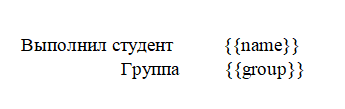

* **PDF:** Вставляется «как есть», блок параметров должен быть пустым `{}`.

> **Ограничение:** Вставка внешнего файла поддерживается только при экспорте в PDF.


#### Примеры использования
**1. Простая вставка DOCX или PDF**

В самом начале документа:
```
!!(title.docx){}

!!(title.pdf){}
```
**2. Вставка с параметрами и управлением нумерацией**

Если нужно передать данные в шаблон и начать нумерацию основного документа, например, со второй страницы:
```
!!(title.docx){
    "taskN": "1",
    "topic": "Сбалансированные деревья поиска",
    "group": "КЛМН-00-00",
    "name": "Иванов П.С."
}
!!section from 2
```

Подробнее про `!!section` в главе [Разрыв раздела](#разрыв-раздела).

**3. Вставка в произвольное место документа**

Документ можно вставить не только в начало.

```markdown
Текст основного документа...

!!(важная вставка.pdf){}

Продолжение основного текста...
```

#### Незнамо на кой оно нужно, но чего сделано не воротишь
Блок параметров парсится как json, так что можно и числа, и объекты, и списки там писать. И такой неожиданый способ использования был предусмотрен...

```json
!!(title.docx){
	"students": [
		{ "name": "Вася", "group": "ЁКЛМН-20-24" },
		{ "name": "Петя", "group": "ЁПРСТ-30-24" },
		null,
	],
	"veryImportantFeature": false,
	"apples": 1.5,
}
```
В ворде такие поля будут доступны через точку, напрмер `{{students.0.name}}`. Парсер расплющивает сложный объект в плоский список ключей. Так что пример выше идентичен такой записи:
```json
!!(title.docx){
	"students.0.name": "Вася",
	"students.0.group": "ЁКЛМН-20-24",
	"students.1.name": "Петя",
	"students.1.group": "ЁПРСТ-30-24",
	"veryImportantFeature": "false",
	"apples": "1.5"
}
```

### Автозамены

Некоторые символы автоматически заменяются на другие

- `—` на `-` ("ИИ" тире на обычные)
- ` - ` на ` – ` (пробел-тире-пробел на вордовое тире)
- `<br>` на перенос строки
- `"текст"` на `«текст»` (кавычки-ёлочки)
- `&laquo; &raquo; &lsaquo; &rsaquo;` на `« » ‹ ›`
- `&nbsp;` на неразрывный пробел
- `&Tab;` на отступ (таб)
- `&Star;` на `*`
- `&#124;` на `|`
- `&amp;` на `&`
- `&shy;` на Soft Hyphen (мягкий перенос)
- `&#x200B;` на ничего (используйте чтобы обмануть парсер)
- `&alpha; &beta; &gamma; &delta; &epsilon; &zeta; &eta; &theta; &iota; &kappa; &lambda; &mu; &nu; &xi; &omicron; &pi; &rho; &sigma; &tau; &upsilon; &phi; &chi; &psi; &omega; &Delta; &Sigma; &Omega;` на `α β γ δ ε ζ η θ ι κ λ μ ν ξ ο π ρ σ τ υ φ χ ψ ω Δ Σ Ω`
- `&infin; &sum; &prod; &radic; &int; &part; &asymp; &ne; &lt; &gt; &le; &ge; &plusmn; &times; &divide;` на `∞ ∑ ∏ √ ∫ ∂ ≈ ≠ < > ≤ ≥ ± × ÷`
- `&copy; &reg; &trade; &sect; &para; &hellip; &bull; &middot; &deg; &euro; &pound; &yen; &cent; &curren; &fnof; &permil;` на `© ® ™ § ¶ … • · ° € £ ¥ ¢ ¤ ƒ ‰`
- `[!page]` на номер текущей страницы
- `[!pages]` на кол-во страниц
- `[!imgs]` на кол-во картинок
- `[!tables]` на кол-во таблиц
- `[!codes]` на кол-во листингов
- `[!sources]` на кол-во источников

### Настройка стилей
Строгость ГОСТа не уступает его разнообразию. В этом разделе представлены правила для настройки стилей.

Строку с ключевым словом `!!rule` можно писать в любом месте документа. Правила применяются ко всему документу. Приоритет определяется только порядком правил.

Размеры (size, spacing) задаются в пунктах (pt).

**Правила:**
* Обычный текст (Абзацы)
	* Размер шрифта
		- `!!rule text size <int>`
		- Пример: `!!rule text size 12`
		- По умолчанию: `14` пт
	* Межстрочный интервал
		- `!!rule text line_spacing <float>`
		- Пример: `!!rule text line_spacing 1.25`
		- По умолчанию: `1.5`
	* Абзацный отступ (Красная строка)
		- `!!rule text indent <float>`
		- Пример: `!!rule text indent 0.75`
		- По умолчанию: `1.25` см
	* Интервал после абзаца
		- `!!rule text spacing after <int>`
		- Пример: `!!rule text spacing after 0`
		- По умолчанию: `8` пт
* Автоматическая расстановка переносов
	- `!!rule hyphenation`
	- По умолчанию: выключено
* Заголовки
	* Размер заголовка
		- `!!rule headings h<1-6>[+] size <int>`
		- Примеры:
			* `!!rule headings h1 size 18` – установить размер 18&nbsp;пт для заголовков первого уровня
			* `!!rule headings h2+ size 14` – установить размер 14&nbsp;пт для заголовков второго и последующих уровней
		- По умолчанию: `14` пт для всех заголовков
	* Интервал до и после
		- `!!rule headings h<1-6>[+] spacing <before|after> <int>`
		- Пример: `!!rule headings h1 spacing after 10`
		- По умолчанию:
			- h1 – before: `18` пт; after: `4` пт
			- остальные – before: `8` пт; after: `4` пт
	* Приведение к верхнему регистру
		- `!!rule headings h<1-6>[+] uppercase`
		- Пример: `!!rule headings h1 uppercase`
		- По умолчанию: выключено для всех
	* Отступ слева вместо абзацного отступа
		- `!!rule headings h<1-6>[+] indent <first_line|left>`
		- Пример: `!!rule headings h1 indent left`
		- По умолчанию: `first_line` (абзацный отступ) для всех
	* Использовать готовый набор стилей
		- `!!rule headings alt_style_1`
		- Эквивалентен последовательности обычных `!!rule`. Может быть переопределён правилами, указанными после.
			```
			!!rule headings h1+ indent left
			!!rule headings h1+ spacing after 10
			!!rule headings h1 size 18
			!!rule headings h1 uppercase
			!!rule headings h1 spacing before 0
			!!rule headings h2 size 16
			!!rule headings h2+ spacing before 15
			```
* Таблицы
	* Начертание названия
		- `!!rule table title style <normal|bold|italic>`
		- Пример: `!!rule table title style italic`
		- По умолчанию: `normal`
	* Размер шрифта названия
		- `!!rule table title size <int>`
		- Пример: `!!rule table title size 12`
		- По умолчанию: наследуется от текста
	* Интервал перед названием
		- `!!rule table spacing before <int>`
		- Пример: `!!rule table spacing before 6`
		- По умолчанию: `0` пт
	* Интервал после таблицы
		- `!!rule table spacing after <int>`
		- Пример: `!!rule table spacing after 6`
		- По умолчанию: наследуется от текста
	* Начертание заголовка
		- `!!rule table heading style <normal|bold|italic>`
		- Пример: `!!rule table heading style bold`
		- По умолчанию: `normal`
	* Выравнивание заголовка
		- `!!rule table heading align <left|center|right>`
		- Пример: `!!rule table heading align left`
		- По умолчанию: `center`
	* Размер шрифта текста таблицы
		- `!!rule table text size <int>`
		- Пример: `!!rule table text size 10`
		- По умолчанию: `12` пт
	* Межстрочный интервал текста таблицы
		- `!!rule table text line_spacing <float>`
		- Пример: `!!rule table text line_spacing 1`
		- По умолчанию: `1.25`
* Листинги
	* Начертание названия
		- `!!rule code title style <normal|bold|italic>`
		- Пример: `!!rule code title style italic`
		- По умолчанию: `normal`
	* Размер шрифта названия
		- `!!rule code title size <int>`
		- Пример: `!!rule code title size 12`
		- По умолчанию: наследуется от текста
	* Интервал перед названием
		- `!!rule code spacing before <int>`
		- Пример: `!!rule code spacing before 8`
		- По умолчанию: `0` пт
	* Интервал после листинга
		- `!!rule code spacing after <int>`
		- Пример: `!!rule code spacing after 6`
		- По умолчанию: наследуется от текста
	* Размер шрифта
		- `!!rule code text size <int>`
		- Пример: `!!rule code text size 10`
		- По умолчанию: `12` пт
	* [Подсветка синтаксиса кода](#подсветка-синтаксиса-кода)
		- `!!rule code highlight`
		- По умолчанию: выключено
* Картинки
	* Размер шрифта подписи
		- `!!rule img text size <int>`
		- Пример: `!!rule img text size 12`
		- По умолчанию: наследуется от текста
	* Интервал перед картинкой
		- `!!rule img spacing before <int>`
		- Пример: `!!rule img spacing before 8`
		- По умолчанию: `0` пт
	* Интервал после абзаца подписи
		- `!!rule img spacing after <int>`
		- Пример: `!!rule img spacing after 6`
		- По умолчанию: наследуется от текста
* Списки
	* Символ для ненумерованных списков
		- `!!rule list unordered style <dash|bullet|keep>`
		- `keep` – Сохранять символ, использованный в исходном файле
		- Пример: `!!rule list unordered style keep`
		- По умолчанию: `bullet`
	* Символ для нумерованных списков
		- `!!rule list ordered style <bracket|dot|keep>`
		- `keep` – Сохранять символ, использованный в исходном файле
		- Пример: `!!rule list ordered style keep`
		- По умолчанию: `bracket`
	* Автоматическая замена знаков препинания в конце элементов списка. Элементы списка оканчиваются запятой или точкой с запятой, последний элемент точкой.
		- `!!rule list autopunctuation <on|off>`
		- Пример: `!!rule list autopunctuation off`
		- По умолчанию: `on`
* Формулы
	* Интервал перед формулой
		- `!!rule formula spacing before <int>`
		- Пример: `!!rule formula spacing before 6`
		- По умолчанию: `0` пт
	* Интервал после формулы
		- `!!rule formula spacing after <int>`
		- Пример: `!!rule formula spacing after 6`
		- По умолчанию: наследуется от текста

#### Примеры

1. Крупный заголовок первого уровня:
	```
	!!rule headings h1 size 18
	!!rule headings h1 uppercase
	```
2. Все заголовки без абзацного отступа:
	```
	!!rule headings h1+ indent left
	```
3. Пример настройки под типичный ГОСТ:
	```
	!!rule headings alt_style_1
	!!rule code title style italic
	!!rule table title style italic
	!!rule table heading style bold
	!!rule hyphenation
	```

### Подсветка синтаксиса кода
По ГОСТу листинги просто чёрно-белые, так что этот пункт не для курсовой

Чтобы включить подсветку кода, добавьте строчку `!!rule code highlight` в любом месте (один раз на весь файл).

Поддерживаются следующие языки:
* html, xml, css, js, ts, jsx, tsx, json, bash, powershell, python, java, c, cpp, csharp, go, rust, php, ruby, swift, kotlin, sql, yaml, markdown, docker, nginx

````html
!!rule code highlight

```html Листинг 1.1 - Красивый листинг
<!DOCTYPE html>
<html lang="en">
<head>
    <meta charset="UTF-8">
    <meta name="viewport" content="width=device-width, initial-scale=1.0">
    <title>Document</title>
</head>
<body>
</body>
</html>
```
````

### Подпись названия и автора
Отображаются в свойствах файла и в заголовке окна при открытии PDF.

```
!!rule title Мой отчёт
!!rule author Иванов П.С.
```

### Что-то ещё
* Установить время редактирования в минутах
	- `!!rule etime <int>`
	- Пример: `!!rule etime 123`
	- По умолчанию: случайное число от 30 до 120
* Установить время создания
	- `!!rule ctime <ISO 8601>`
	- Пример: `!!rule ctime 2026-02-18`
	- По умолчанию: время создания `.g.md` файла
* Установить время изменения
	- `!!rule mtime <ISO 8601>`
	- Пример: `!!rule mtime 2026-02-18T12:30:00`
	- По умолчанию: время рендера
* `!!rule rainbow`


## Редактор таблиц

Расширение упрощает работу с Markdown-таблицами, предоставляя удобный графический интерфейс (GUI).

### Как открыть редактор
Чтобы перейти в графический режим:
1. Откройте Markdown-файл.
2. Наведите курсор на любую область существующей таблицы.
3. Нажмите на появившуюся над кодом кнопку **"Edit table"**.

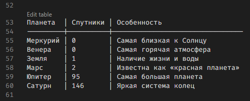

### Двусторонняя синхронизация
Редактор работает в режиме реального времени:
* **Из кода в GUI:** Любые правки текста в Markdown-файле мгновенно отображаются в интерфейсе расширения.
* **Из GUI в код:** Как только вы изменяете содержимое ячейки или структуру (добавляете ряды/колонки), изменения автоматически записываются в исходный файл.

> **Примечание:** Undo/Redo в GUI работают только частично, если не сработало, повторите в текстовом редакторе.

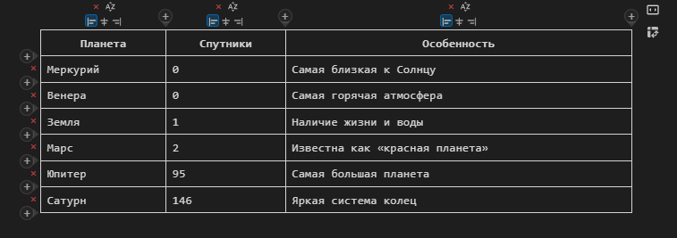

### Горячие клавиши

| Действие                   | Сочетание клавиш                     |
|----------------------------|--------------------------------------|
| Навигация по ячейкам       | `Shift` + `Alt` + `Стрелки`          |
| Переместить строку/столбец | `Ctrl` + `Shift` + `Alt` + `Стрелки` |
| Добавить строку снизу      | `Ctrl` + `Enter`                     |
| Добавить строку сверху     | `Ctrl` + `Shift` + `Enter`           |
| Добавить столбец справа    | `Alt` + `Enter`                      |
| Добавить столбец слева     | `Alt` + `Shift` + `Enter`            |
| Дублировать текущую строку | `Ctrl` + `D`                         |
| Удалить текущую строку     | `Ctrl` + `Shift` + `Backspace`       |
| Удалить текущий столбец    | `Alt` + `Shift` + `Backspace`        |

## ⚙️ Настройки расширения

| Параметр                                  | Описание                                                                           |
|-------------------------------------------|------------------------------------------------------------------------------------|
| `md2gost.tables.editor.enabled`           | Включает или отключает отображение кнопки **"Edit table"** над таблицами.          |
| `md2gost.tables.borderStyle`              | Стиль внешних границ таблиц: добавлять `\|` по краям, убирать, или не изменять.    |
| `md2gost.tables.alwaysAddLeftColon`       | Добавлять ли двоеточие для левого выравнивания в таблицах (`:---` или `---`).      |
| `md2gost.tables.compact`                  | Выравниванивать ли столбцы таблицы пробелами.                                      |
| `md2gost.ui.inlayHints`                   | Отображать встроенные подсказки в тексте (например, «Рисунок # –»).                |
| `md2gost.ui.enhancedHighlighting`         | Подсветка синтаксиса Markdown с поддержкой md2gost.                                |
| `md2gost.ui.enhancedPreview`              | Улучшенный предпросмотр Markdown с поддержкой синтаксиса md2gost.                  |
| `md2gost.formatter.suppressDefaultPrompt` | Отключает предложение использовать md2gost в качестве форматировщика по умолчанию. |
| `md2gost.formatter.replaceEmDash`         | Заменять ли Em dash (—) на En dash (–).                                            |
| `md2gost.completion.tableSeparator`       | Автоматически предлагать строку-разделитель (`\|---\|`) для новой таблицы.         |
| `md2gost.completion.listItem`             | Автоматически продолжать нумерованные и маркированные списки на новой строке.      |
| `md2gost.render.removeIntermediateDocx`   | Удалять промежуточный файл DOCX после успешной конвертации в PDF.                  |
